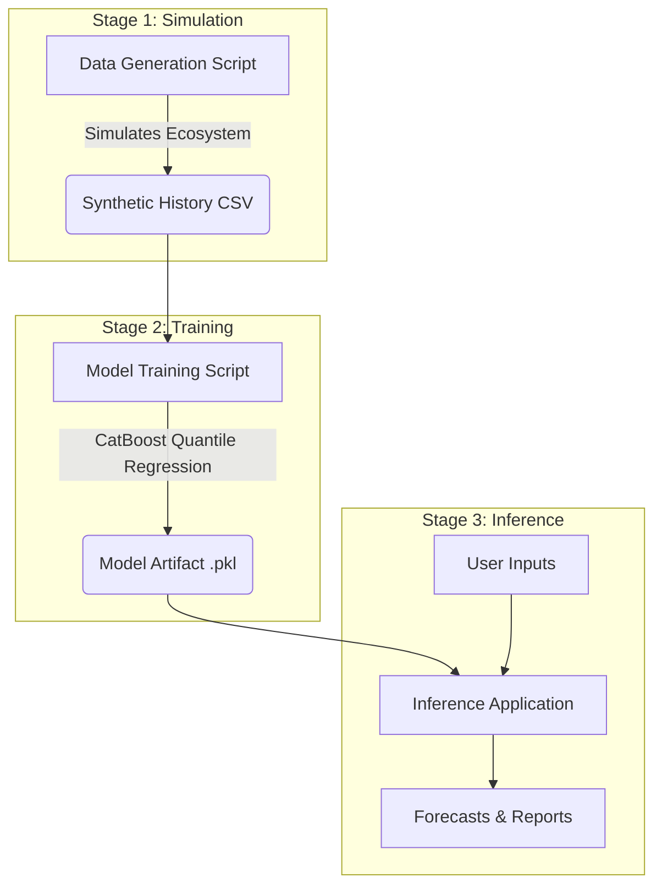

# PMIS System Logic & Architecture Walkthrough

This document explains how the PMIS Solution generates its predictive insights, from raw data generation to end-user forecasts.

## 1. High-Level Data Flow

The system operates in three distinct stages: **Simulation**, **Training**, and **Inference**.

---

## 2. Stage 1: The "Physics" of Data Generation

To train the AI without sensitive client data, we created a **simulation engine** that mimics the real-world complexities of Indian infrastructure projects.

### Core Logic: The Friction Equation
The simulation applies "friction" multipliers to planned durations based on realistic factors.

$$ \text{Actual Duration} = \text{Planned Duration} \times \text{Friction Factor} + \text{Event Delays} $$

| Factor | Logic | Impact |
| :--- | :--- | :--- |
| **Geography** | State/Terrain profiles (e.g., Hilly states like Uttarakhand have higher friction than Plain states like Punjab). | 1.0x - 1.8x multiplier |
| **Security (LWE)** | Districts flagged as Left Wing Extremism (Naxal) affected in `JHARKHAND_MAP`. | +40% duration |
| **Vendor Tier** | Tier 1 (Tata/L&T) vs. Tier 3 (Local Contractors). | Tier 1 is 15% faster; Tier 3 is 30% slower |
| **Monsoon** | Checks if task dates fall in June-Sept. | +10% to +50% based on state severity |

### Event Injection
Specific "disasters" are probabilistically injected to teach the model about root causes:
- **CNT Act Issues:** If `Land_Type` is "Tribal", add 60-120 days delay.
- **Vendor Rework:** If Tier 3 vendor performs "Civil" works, small chance of quality failure.

---

## 3. Stage 2: AI Model Structure

The system uses **Quantile Regression** to provide probabilistic confidence intervals, not just a single number.

### The Three Models
1.  **P10 (Optimistic):** The "Best Case" scenario (10th percentile).
2.  **P50 (Realistic):** The most likely outcome (Median).
3.  **P90 (Pessimistic):** The "Worst Case" scenario (90th percentile).

### Features Used
The model learns to correlate these inputs with the `Actual_Duration`:
- `Project_Type` (e.g., Hospital, Road)
- `District` (Location context)
- `LWE_Flag` (Security risk)
- `Vendor_Tier` (Execution capability)
- `Land_Type` (Regulatory hurdle)
- `Monsoon_Flag` (Seasonal risk)

---

## 4. Stage 3: The Inference Engine

When a user uses the "Pre-Start Estimator", the app performs the following steps:

1.  **Input Collection:** User selects Project Type, Location, Vendor, etc.
2.  **WBS Generation:** Loads standard tasks for that project type.
3.  **Feature Assembly:** Constructs a feature row for *each task* based on the inputs (e.g., calculating if a task hits Monsoon season based on the Start Date).
4.  **Prediction:**
    *   Feeds features into the **P50 Model** to get the predicted duration for each task.
    *   Feeds features into P10 and P90 models for aggregate bounds.
5.  **Critical Path Method (CPM):**
    *   Uses the *predicted* durations (not planned ones) to calculate the network diagram.
    *   Determines the true project end date.
6.  **Risk Reasoning:**
    *   Compares `Predicted - Planned`.
    *   If huge variance, it reverse-engineers the cause (e.g., "Is LWE active? Yes -> Display 'LWE Logistics Friction'").

### Why this matters
The app doesn't just say "Delayed by 50 days". It says:
> **Delayed by 50 days.**
> *Primary Cause: Monsoon Slowdown + Tier 3 Vendor inefficiency.*

This is what makes the system "Strategic" rather than just a calculator.
