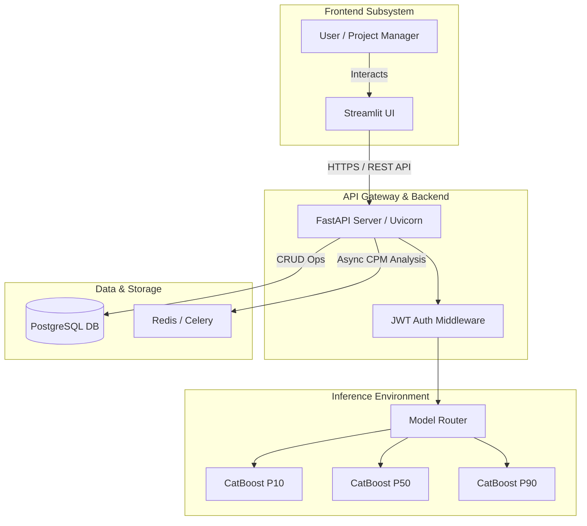

# Phase 2: Enterprise API Architecture Blueprint

This document outlines the Phase 2 roadmap for the Strategic Project Analytics (SPA) PMIS module. The goal of Phase 2 is to decouple the monolithic Streamlit Proof-of-Concept into a scalable, production-ready microservice architecture using **FastAPI**.

## 1. Target Architecture (Phase 2)



### Key Architectural Upgrades:
- **Decoupled UI:** Streamlit acts purely as a presentation layer. All heavy lifting is offloaded.
- **RESTful API:** A standardized FastAPI backend serves structured JSON to any frontend (Streamlit, React, or mobile apps).
- **Asynchronous Execution:** Heavy Critical Path Method (CPM) analyses and PDF generation are moved to a Celery task queue to prevent HTTP blocking.

---

## 2. API Data Contract (OpenAPI / Swagger Schema)

To enforce strict data validation before inputs reach the CatBoost model, we will implement **Pydantic Models** in FastAPI.

### `schemas.py`

```python
from pydantic import BaseModel, Field
from typing import List, Optional

class TaskBase(BaseModel):
    task_id: int = Field(..., description="Unique ID for the WBS task")
    task_name: str = Field(..., min_length=3, max_length=255)
    task_category: str = Field(..., description="E.g., Civil, Regulatory, Procurement")
    planned_duration: int = Field(..., gt=0, description="Planned duration in days")
    predecessors: Optional[List[int]] = Field(default=[], description="List of preceding task IDs")

class PredictRequest(BaseModel):
    project_type: str = Field(..., description="Template type, e.g., Construction_Hospital")
    district: str = Field(..., description="Implementation district")
    lwe_flag: int = Field(..., ge=0, le=1, description="Left Wing Extremism risk flag")
    land_type: str = Field(..., description="E.g., Govt Land, Tribal")
    vendor_tier: int = Field(..., ge=1, le=3, description="1=Premium, 3=Local")
    start_date: str = Field(..., description="ISO formated start date YYYY-MM-DD")
    wbs_tasks: List[TaskBase]

class TaskPrediction(BaseModel):
    task_id: int
    predicted_duration_p50: int
    risk_factor: str
    delay_explanation: str

class PredictResponse(BaseModel):
    project_duration_p10: int
    project_duration_p50: int
    project_duration_p90: int
    critical_path: List[int]
    task_predictions: List[TaskPrediction]
    estimated_completion_date: str
```

---

## 3. Implementation Roadmap (7-Day Sprint)

**Day 1: Repo Restructuring & Setup**
- Migrate to a Monorepo structure (`/frontend`, `/backend`, `/ml-pipeline`).
- Initialize FastAPI project with Poetry/Pipenv.

**Day 2: Schema Definition & Model Porting**
- Implement Pydantic `schemas.py`.
- Load the `pmis_model.pkl` safely into FastAPI app state on startup (`@asynccontextmanager`).

**Day 3: Endpoint Development**
- Create `POST /api/v1/predict/wbs` for the Estimator module.
- Create `POST /api/v1/predict/tracker` for Mid-Project re-forecasting.

**Day 4: Streamlit Refactoring**
- Strip ML inference out of Streamlit UI.
- Use the `requests` library in Streamlit to bridge to the FastAPI endpoints.

**Day 5: Async Task Queues (Optional / Stretch)**
- Introduce `Celery` + `Redis` for heavy Monte Carlo CPM execution.

**Day 6: Containerization**
- Write `Dockerfile` for Backend.
- Write `Dockerfile` for Frontend.
- Map them via `docker-compose.yml`.

**Day 7: E2E Testing & Documentation**
- Validate end-to-end data flow.
- Ensure Swagger UI (`/docs`) accurately reflects the newly integrated ML backend.
