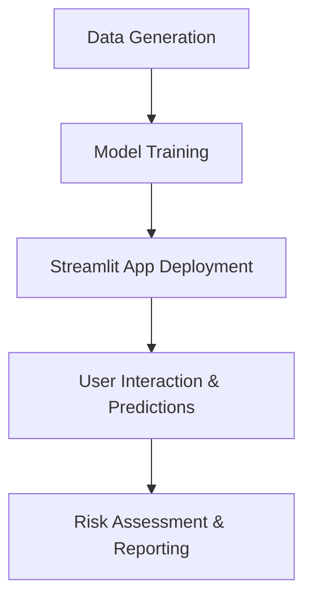
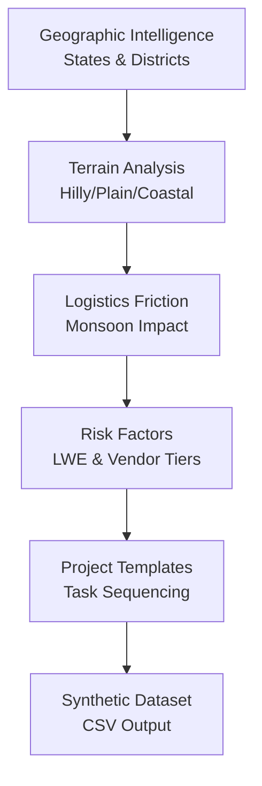

# KPMG PMIS - Strategic Project Management Insights

## Overview

KPMG PMIS (Project Management Information System) is an AI-powered strategic insights platform designed to predict project delays and provide actionable intelligence for project management in challenging environments. Built for KPMG Advisory, this system leverages machine learning to forecast project durations using probabilistic quantile regression, incorporating factors like geographic challenges, monsoon impacts, vendor tiers, and Left Wing Extremism (LWE) risks.

The platform includes:
- **Synthetic Data Generation**: Realistic project data simulation considering Indian geographic and logistical constraints
- **AI Model Training**: CatBoost-based quantile regression models for P10, P50, and P90 delay predictions
- **Interactive Dashboard**: Streamlit-based web application for real-time project planning and risk assessment
- **Explainability**: SHAP-based feature importance analysis for decision transparency

## Features

### Data Generation (`data_generation.py`)
- Geographic intelligence for all Indian states and districts
- Terrain-based logistics friction modeling
- Monsoon impact simulation
- Vendor tier and LWE risk incorporation
- Realistic project task sequencing

### Model Training (`model.py`)
- Probabilistic quantile regression (P10, P50, P90)
- CatBoost regressor with hyperparameter tuning
- TF-IDF vectorization for categorical features
- SHAP explainability analysis
- Production-ready model artifacts

### Web Application (`pmisapp.py`)
- Project delay prediction interface
- Interactive WBS (Work Breakdown Structure) planning
- Geographic district mapping for Jharkhand
- PDF report generation
- Risk assessment dashboards
- Professional KPMG-branded UI

## Project Workflow

The following diagram illustrates the high-level workflow of the KPMG PMIS system:



### Data Generation Process

The synthetic data generation incorporates multiple layers of realism:



## Installation

### Prerequisites
- Python 3.8+
- Virtual environment (recommended)

### Setup Steps

1. **Clone or navigate to the project directory:**
   ```bash
   cd /path/to/PMIS
   ```

2. **Activate the virtual environment:**
   ```bash
   source PMIS/bin/activate
   ```

3. **Install dependencies:**
   ```bash
   pip install -r requirements.txt
   ```

4. **Generate synthetic data (if not present):**
   ```bash
   python data_generation.py
   ```

5. **Train the model (if not present):**
   ```bash
   python model.py
   ```
   This will generate the trained model artifact and Jupyter notebook.

## Usage

### Running the Application
```bash
streamlit run pmisapp.py
```

The application will open in your default web browser at `http://localhost:8501`.

### Key Workflows
1. **Project Planning**: Select project type, district, and parameters to get delay predictions
2. **WBS Generation**: Automatically generate task sequences with duration estimates
3. **Risk Analysis**: View SHAP explanations for prediction drivers
4. **Report Export**: Generate PDF reports for project proposals

### Data Files
- `kpmg_pmis_synthetic_data.csv`: Synthetic project data with geographic and risk factors
- `kpmg_pmis_model.pkl`: Trained model bundle with CatBoost models and vectorizers

## Dependencies

The project requires the following Python packages (see `requirements.txt`):

- pandas: Data manipulation
- numpy: Numerical computing
- scikit-learn: Machine learning utilities
- catboost: Gradient boosting framework
- shap: Model explainability
- streamlit: Web application framework
- plotly: Interactive visualizations
- graphviz: Graph visualization
- fpdf: PDF generation
- joblib: Model serialization
- matplotlib, seaborn: Plotting libraries
- openpyxl: Excel file handling
- networkx: Graph algorithms
- scipy: Scientific computing

## Project Structure

```
PMIS/
├── config.py                 # Configuration constants
├── data_generation.py        # Synthetic data creation
├── model.py                  # Model training pipeline
├── pmisapp.py               # Streamlit web application
├── requirements.txt          # Python dependencies
├── kpmg_pmis_synthetic_data.csv  # Generated dataset
├── kpmg_pmis_model.pkl      # Trained model artifact
├── Kpmg_Pmis_Training.ipynb # Training notebook
├── tests/                   # Test suite
│   └── smoke_test.py
└── PMIS/                   # Virtual environment
```

## Model Architecture

The system uses quantile regression with CatBoost to predict project delays at three confidence levels:
- **P10**: Optimistic scenario (10th percentile)
- **P50**: Median prediction (50th percentile)
- **P90**: Conservative scenario (90th percentile)

Features include:
- Project type and task categories
- Geographic district information
- LWE risk flags
- Land acquisition types
- Vendor tier classifications
- Planned duration baselines
- Monsoon impact indicators

## Testing

Run the smoke test suite:
```bash
python tests/smoke_test.py
```

## License

This project is proprietary software developed for KPMG Advisory. All rights reserved.

## Contributing

Please follow KPMG's internal development guidelines for contributions.

## Support

For technical support or questions, contact the KPMG PMIS development team.